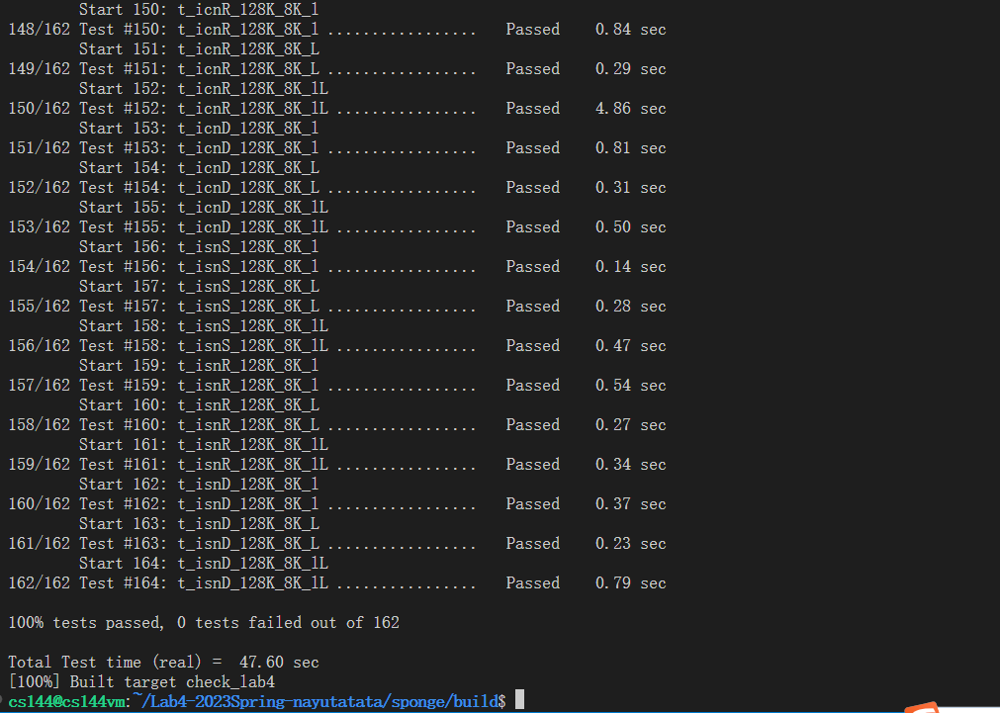

## Lab4 Writeup

Myname:李睿

My student number: 211220133

This lab took me about 15 hours to do. I did attend the lab session.

### Program Structure and Design

本次实验添加了`alive`、`waittime`以及`check_state`三个成员，分别表示该TCP连接是否有效，距离上次收到包等了多久以及对于`Receiver`和`Sender`的状态的检查。同时为了方便代码的复用，编写了两个宏，分别是`SEND`和`SET_ALL_ERROR`。具体的原因会在下一节详说。

### Implementation Challenges

根据`tutorials`的指引，先写`connect`、`write`、`end_input_stream`，这些函数的含义基本都是`sender`主导的。在连接的层面上，这三个函数是无需考虑`sender`要发送什么类型的报文段的，因为`sender`有自己的状态量，他会根据发送的报文的序号来判断该报文是`SYN`还是普通报文，也会通过`eof`判断自己是否应该发送`FIN`报文。实现的时候会发现一个问题，`sender`的发送队列和该连接的发送队列并不同步，所以每次更新`sender`的队列时，我们都需要同步更新该连接的队列，所以就有了`SEND`宏，表示“真正地发送”。

然后考虑`receive`、`tick`和`~TCPConnection`。在这里，有两个操作是被频繁使用的——一是查看当前发送端和接受端的状态、二是将发送端和接收端都设为错误状态。针对前一个操作，我们通过函数`check_state(string senderstate,string receiverstage)`，根据不同的状态返回对应的状态码即可；对于后一个操作，编写了`SET_ALL_ERROR`宏，方便直接对全局变量进行操作。

`receive`的逻辑非常复杂，实现的时候出现了很多差错，比如：在收到一个包的时候没有检查这个包是不是ack包，就直接继续发包了。由于TCP连接是全双工的，所以可以视为有“两个连接”，一个是从A到B发送，一个是从B到A发送。这两个过程同时存在，所以要检查接收到的包到底是ack还是数据。

### Remaining Bugs

刚开始测有一个`Timeout`，重测了一遍之后就过了。

